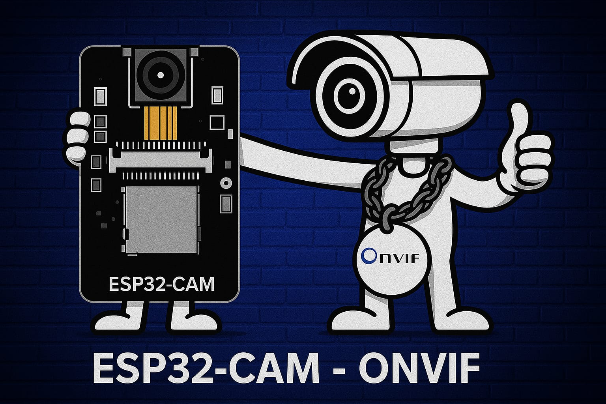

# ESP32-CAM ONVIF/RTSP Surveillance Camera (v3.0)

**Ultra-Efficient, Feature-Rich, and Modern Network Camera Firmware for ESP32-CAM**

[](https://www.espressif.com/en/products/socs/esp32)
[](LICENSE)
[]()



Transform your affordable (~$5) ESP32-CAM module into a professional-grade **ONVIF Security Camera**. This firmware is engineered for **ultra-efficiency**, featuring a low-latency RTSP stream (~20 FPS), a beautiful Dark Mode Web UI, OTA updates, and deep integration with NVRs like **Hikvision**, **Dahua**, and **BlueIris**.

---

## 🚀 Key Features

### 🎥 Professional Streaming
- **High-Performance RTSP**: Stable MJPEG streaming at **20 FPS** (VGA 640x480) on standard port `554`.
- **ONVIF Profile S Compatible**: Fully discoverable by NVRs. Supports `GetStreamUri`, `GetSnapshotUri`, `GetVideoSources` (Brightness/Contrast sync), and `PTZ` stubs.
- **Ultra-Low Latency**: Optimized stream buffers for minimal lag (`<200ms` on LAN).

### 💻 Modern Web Interface
- **Cyberpunk / Slate Dark Theme**: A responsive Single Page Application (SPA).
- **Live Dashboard**: View live stream, toggle Flash, take Snapshots (direct download).
- **Camera Settings**: Adjust Resolution, Quality, Brightness, Contrast, and Flip/Mirror in real-time.
- **WiFi Manager**: Scan and connect to networks directly from the UI.
- **System Control**: OTA Firmware Updates, Reboot, and Time Sync.

### ⚙️ Engine Optimizations
- **NTP Time Sync**: Automatic time synchronization with `pool.ntp.org` (Default: India IST).
- **Manual Time Sync**: One-click "Sync with Browser" for isolated networks.
- **Zero-Allocation Discovery**: Memory-efficient ONVIF Probe handling (no heap fragmentation).
- **Crash Prevention**: Robust error handling for "Drop the Loop" and "Streamer NULL" issues.

---

## 🛠️ Hardware Setup

| Component | Description |
|-----------|-------------|
| **ESP32-CAM** | AI-Thinker Model (OV2640 Module) |
| **Power Supply** | 5V 2A (Stable power is critical for WiFi/Flash) |
| **MicroSD Card** | Optional (Formatted FAT32) |
| **Cooling** | Recommended (Chip gets hot during streaming) |

**Pinout Constraints:**
- **Flash LED**: `GPIO 4` (Shared with SD Card Data). *Note: Using Flash LED forces SD Card to 1-bit mode.*
- **Status LED**: `GPIO 33` (Inverted Logic).

---

## 📦 Installation Guide

### Option A: PlatformIO (Recommended)
This project is optimized for **VS Code + PlatformIO**.

1.  **Clone the Repo**:
    ```bash
    git clone https://github.com/John-Varghese-EH/ESP32CAM-ONVIF-DVR-NVR-Recording.git
    ```
2.  **Open in VS Code**: Open the folder. PlatformIO will auto-configure.
3.  **Configure WiFi**: Edit `ESP32CAM-ONVIF/config.h`:
    ```cpp
    #define WIFI_SSID       "Your_WiFi_Name"
    #define WIFI_PASSWORD   "Your_WiFi_Password"
    
    // Time Settings (Default: India)
    #define GMT_OFFSET_SEC  19800   // 5.5 * 3600
    ```
4.  **Upload**: Connect ESP32-CAM (GPIO0 -> GND) and click **Upload**.
5.  **Monitor**: Open Serial Monitor (115200 baud) to see the IP address.

### Option B: Arduino IDE
1.  Install **ESP32 Board Manager** (v2.0.14+).
2.  Install Libraries: `ArduinoJson` (v6.x), `Micro-RTSP` (Geeksville fork).
3.  Select Board: **AI Thinker ESP32-CAM**.
4.  Compile and Upload.

---

## 📹 NVR / HVR Configuration Guide

Confimed working on **Hikvision DS-7200 Series**, **Dahua**, and **BlueIris**.

### Step 1: Network Setup
Ensure the ESP32-CAM is on the same LAN as your NVR.
- **IP Address**: DHCP (default) or Static (configure in `config.h`).
- **Ports**:
    - **ONVIF**: `8000` (Standard for Hikvision)
    - **RTSP**: `554`
    - **Web**: `80`

### Step 2: Add Camera to Hikvision NVR
1.  Go to **Camera Management** > **IP Camera**.
2.  Click **Add** (Custom Add).
3.  **Protocol**: `ONVIF`.
4.  **IP Address**: `[ESP32-IP]` (e.g., `192.168.1.50`).
5.  **Management Port**: `8000`.
6.  **User**: `admin` (Default).
7.  **Password**: `esp123` (Default).
8.  **Transfer Protocol**: `Auto` or `TCP` (Recommended for stability).
9.  Click **OK**.

> **Note**: If "Offline (Parameter Error)":
> - Check if `Time Sync` is correct (NVR and Camera time must match).
> - Reboot the Camera via Web UI.

---

## 🖥️ Web Interface Guide

Access the camera at: `http://[ESP32-IP]/`

### 1. Dashboard
- **Live Stream**: View the MJPEG feed.
- **Quick Actions**:
    - `⚡ Flash`: Toggle the high-power LED (Instant response).
    - `📸 Download Snap`: Save a high-res JPG to your device.
    - `⏯ Play/Pause`: Stop stream to save bandwidth.

### 2. Camera Settings
- **Resolution**: Fixed to VGA (640x480) for NVR stability.
- **Quality**: 10 (High) to 63 (Low). Lower = Faster frame rate.
- **Brightness/Contrast**: Adjust for lighting conditions. *Syncs with NVR automatically.*

### 3. System
- **WiFi Manager**: Scan for networks and switch connection without recompiling.
- **Time Sync**:
    - **NTP**: Automatic.
    - **Manual**: Click `🕒 Sync Time` to set camera time from your browser.
- **OTA Update**: Upload new `.bin` firmware files wirelessly.

---

## ⚠️ Troubleshooting

- **"Stream Type Not Supported"**:
    - Set ESP32 to **VGA (640x480)**. Many NVRs do not support SVGA/XGA via ONVIF/MJPEG.
- **Purple/Green Lines**:
    - Power supply issue. Use a high-quality 5V 2A adapter.
- **"Drop the Loop" / Reboot**:
    - Wifi signal too weak. Move closer to router or use an external antenna.
- **ONVIF Discovery Fails**:
    - Enable **Multicast** on your router.
    - Firewall: Allow UDP port 3702.

---

## 📜 License
MIT License. Free for personal and commercial use.

**Developed by John Varghese & J0X**
*Based on the Micro-RTSP & ESP32-Camera libraries.*
